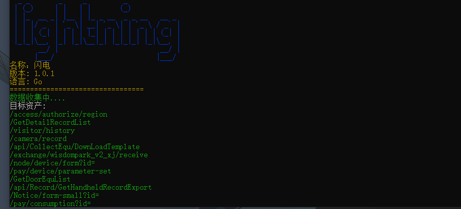
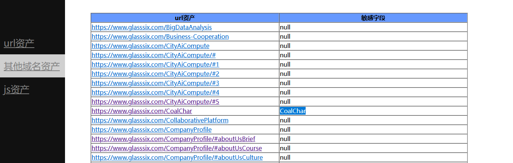

# lightning

#### 介绍
我在学习过程当中，面对众多的功能，不能及时有效的提取目标有效信息。所以我开发了这款提取目标的url，js，其他域名(子域名)，能够及时快速的发现敏感接口。采用go开发，利用协程提取信息，快人一步的发现有效信息(一般网站可以做到毫秒级别)。同时我采用半框架式，封装了基础提取，所以不局限于提取敏感信息发掘，比如还能拓展批量搜索，针对post请求的漏洞测试。所以后期我会继续拓展此框架的功能。同时感兴趣的小伙伴也可以拓展. **此开源只做学习交流。严禁用于非法用途！** 
#### 使用说明
windows用户：直接使用cmd命令使用lightning.exe，linux用户需要使用命令go build  lightning.go打包成二进制文件才能使用

【命令说明】：

- -u 目标的域名(lightning.exe -u xxx.com)
- -i 生成html文档(lightning.exe -u xxx.com -i 生成html的名称 会生成在tem文件下)
- -s cmd中显示详细信息（lightning.exe -u xxx.com -s）
- -c 设置cookie(lightning.exe -u xxx.com -c cookie值)
- -us 设置User-Agent(lightning.exe -u xxx.com -us user-agent值)
- -t 设置线程数（默认30线程）
- -h 查看帮助
- 识别敏感url的字典在fuzz下的js.txt中，有需求的小伙伴可以自行配置

#### 参与贡献
感谢我的好友雪见对生成文档的部分前端帮助

